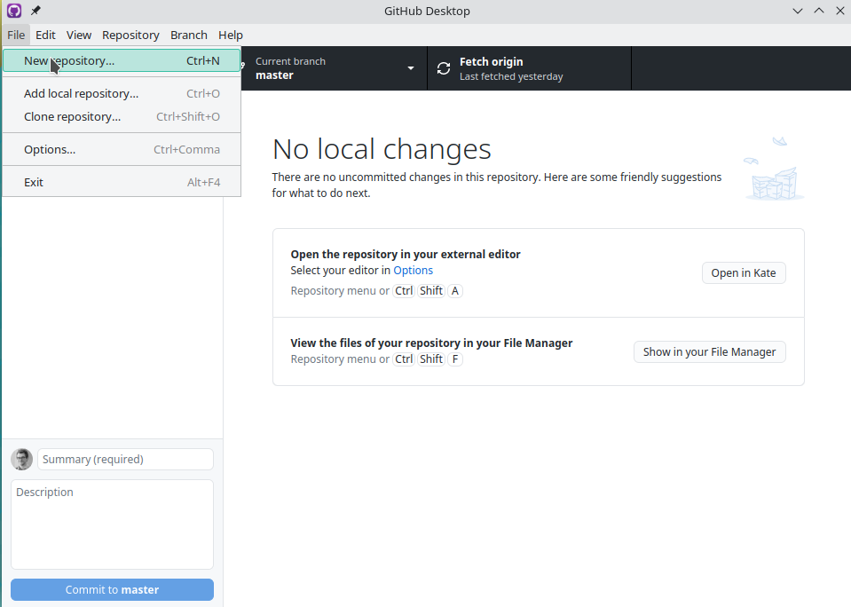
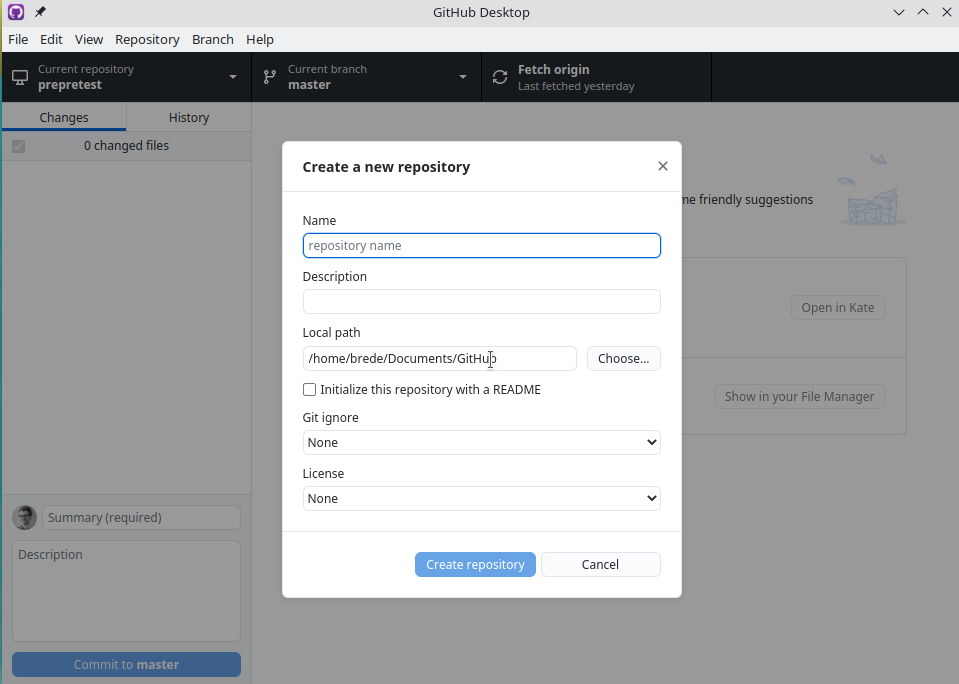
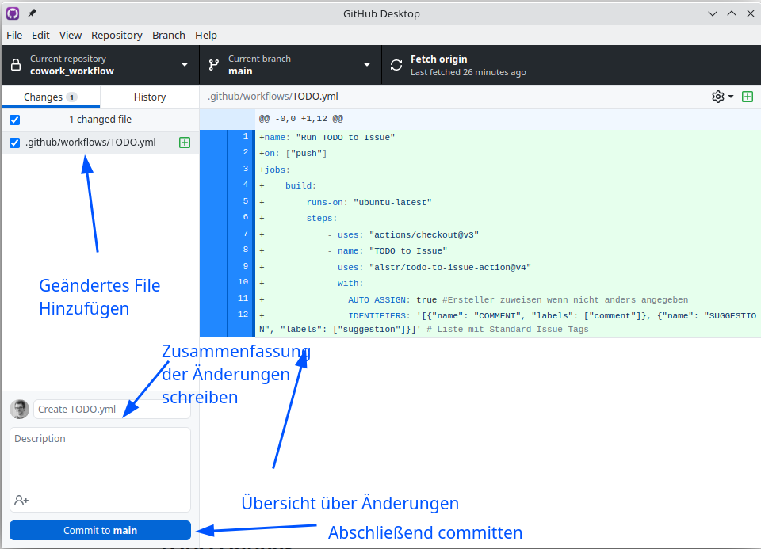
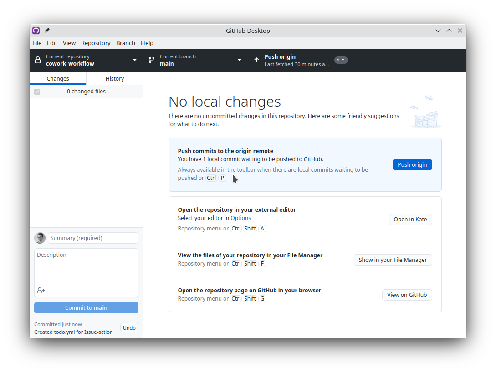

`git` und die darauf basierenden Hosting-Services Github und Gitlab sind Tools zur Versionskontrolle, die im Entwicklungskontext den De-Facto Industriestandard darstellen.
Der Grund für diesen Erfolg ist dabei die Baum-artige Struktur in der Änderungen am Code-Stamm getracked und nachvollzogen werden können.
Über verschiedene "branches" können außerdem Änderungen gebaut, erweitert und getestet werden, bevor sie in den zentralen Codestamm (bei Github der "main"-branch) "gemerged" werden.
Dabei ist es generell möglich, Änderungen in allen möglichen Dateiformaten zu tracken, so richtig sinnvoll sind Änderungen und Änderungsabschnitte aber vor allem in Klartextformaten ohne Serialisierung verständlich.
Textfiles müssen aber ja nicht notwendigerweise nur Code enthalten.
Mit der wachsenden Beliebtheit von Rmarkdown und neuerdings Quarto geht (zumindest in der R-Community) der Trend zum Verfassen von Texten in auf markdown basierenden Formaten, die mit Hilfe von Pandoc in andere Formate kompiliert werden können.
Da diese Formate in einfachen Textfiles abgespeichert werden, können so die Vorteile von git zum Tragen kommen.
Ein workflow zum gemeinsamen Erstellen von Texten wie er zum Beispiel beim Schreiben gemeinsamer Publikationen nötig ist, gestützt auf eins der populären markdown Formate und git, könnte eine echte Alternative zur Co-Autorenschaft in Word sein.
Dabei hat der vorgeschlagene Workflow die folgenden Vorteile:

-   Quarto/Rmarkdown[^1] haben auch ohne Kombination mit git Vorteile beim Erstellen und Einbinden von Grafiken, Tabellen und statistischen Ergebnissen
-   mit git kommt ein Versionsmanagement dazu, dass Änderungen verfolgbar und auch zurückziehbar macht, ohne dass die Festplatte voll von `manuskript_final_v1_v3.docx` etc. wird
-   die gesamte Änderungsgeschichte ließe sich publizieren, was aus Gesichtspunkten offener Wissenschaft attraktiv sein kann. Muss aber nicht.
-   mit Github/Gitlab Issues kommt ein ganzer Stack an Projektmanagement-Tools dazu, der optional genutzt werden kann
-   mit Github/Gitlab Action lassen sich Tests und Updates vor oder beim Commit automatisieren
-   das Zusammenarbeiten über Betriebssystem-Grenzen hinweg ist problemlos. Kein Ärger mehr mit verschiedenen Office-Versionen oder Formatierungskonflikten zwischen MS Office und Open Scource Lösungen

Dabei sind die Nachteile relativ gering - Quarto ist sehr weit gekommen und unterstützt alle Standard-Anforderungen an akademische Arbeiten - Zitieren, Formatieren und das Nutzen von Latex-Templates ist kein Problem.
Dazu kommt dass zumindest bei der Nutzung von RStudio seit kurzem auch eine WYSIWYG-Lösung zur Texteditirung dazugekommen ist - die Bedienung des Visual Editors sollte Leuten, die an Word gewöhnt sind, keine so große Herausforderunge mehr bereiten wie das Schreiben in reinem `markdown`.
Der einzige größere Nachteil ist, dass sich der Ablauf zum Kommentieren ändert - dazu kommen wir aber später.

### Einrichtung

Unter Mac und Unix-Distros ist git vorinstalliert, unter Windows muss der Client noch installiert werden:
[Download git](https://git-scm.com/download/win)

Um Änderungen darzustellen gibt es zwar auch Funktionalität in RStudio, die github Desktop-GUI ist aber auch ganz schick:
[Download github Desktop](https://desktop.github.com/)

Rstudio als IDE bietet sich an, hier wird aber davon ausgegangen, dass die Installation bereits passiert ist.
Außerdem ist zum Einbinden von Zitationen in Quarto-Texten eine Zotero-Installation mit dem [Better Bibtex](https://retorque.re/zotero-better-bibtex/) Addon zu empfehlen.
Im visuellen Editor gibt es einen eigenständigen Zitationsmanger mit Zotero-Connection, im Source-Editor habe ich aber bessere Erfahrungen mit dem `citr`-Paket gemacht, das es leider nicht mehr auf Cran aber noch auf [github](https://github.com/crsh/citr) gibt.
Zum Schreiben mit Rmarkdown oder der Erweiterung Bookdwon braucht es nur die entsprechenden R-Pakete, für Quarto is nocht eine eigenständige Quarto-Installation nötig. Die ist [hier](https://quarto.org/docs/get-started/) zu finden.

Zuletzt wird ein Github-Repo[^2] benötigt.

Zur Einrichtung braucht es erst einen Github-Account, der Rest kann über die Github-Desktop-GUI erledigt werden.
Nach der Anmeldung in der GUI kann dafür einfach wie in [Figure 1](#fig-CreateRepo) zu sehen auf `File -> New repository` geklickt oder `Strg + N` gedrückt werden.

<figure>

<figcaption aria-hidden="true">Figure 1: Repo erstellen</figcaption>
</figure>

Im sich daraufhin öffnenden Dialog ([Figure 2](#fig-repoDialogue)) kann das zu erstellende Repo eingerichtet werden.
Neben Name, Beschreibung und lokalem Speicherort kann hier auch eine Lizenz und ein gitignore-Vorbild angegeben werden.
Das gitignore-File gibt an, welche Dateien grundsätzlich nicht ins Repo aufgenommen werden sollen - für Projekte wie hier beschrieben bietet sich hier das R-Template an.
Außerdem

<figure>

<figcaption aria-hidden="true">Figure 2: Einstellungen bei Repoerstellung</figcaption>
</figure>

Nach der lokalen Erstellung muss das Repo noch mit einem Github-remote verknüpft werden. Das kann einfach mit "Publish Repository" ([Figure 3](#fig-publishRepo)) geschehen, solange noch kein Repo mit dem entsprechenden Namen existiert.

<figure>

<figcaption aria-hidden="true">Figure 3: Erstellung des Github-Repos</figcaption>
</figure>

Wenn sich nun in Github Web angemeldet wird, müsste das neue repository in der Liste auftauchen.
Nach der o.g. Erstellung können im Repo unter den Einstellungen -\> Collaborators noch Coautoren eingeladen werden.

Als Vorbereitung des Erstellens von Issues für Kommentare kann dem Repo noch die [TODO to Issue Action](https://github.com/marketplace/actions/todo-to-issue) hinzugefügt werden. Diese legt automatisch Issues an, wenn in einem Textfile ein TODO-Kommentar angelegt ist.
Zum Einbinden in das Repo muss im Repo ein Ordner namens `.github` und darin einer namens `workflows` angelegt werden.
In diesem `workflows`-Ordner wird dann ein YAML file mit dem Namen `TODO.yml` angelegt, das den folgenden Inhalt enthält:

``` yaml
name: "Run TODO to Issue"
on: ["push"]
jobs:
    build:
        runs-on: "ubuntu-latest"
        steps:
            - uses: "actions/checkout@v3"
            - name: "TODO to Issue"
              uses: "alstr/todo-to-issue-action@v4"
              with:
                AUTO_ASSIGN: true #Ersteller zuweisen wenn nicht anders angegeben
                IDENTIFIERS: '[{"name": "COMMENT", "labels": ["comment"]}, {"name": "SUGGESTION", "labels": ["suggestion"]}]' # Liste mit Standard-Issue-Tags
```

Damit die Action läuft muss die Änderung noch ins Repo gepushed werden. Dazu einmal in Github Dektop committen ([Figure 4](#fig-commit)) und dann pushen ([Figure 5](#fig-push)).

<figure>

<figcaption aria-hidden="true">Figure 4: Änderungen Committen</figcaption>
</figure>

<figure>

<figcaption aria-hidden="true">Figure 5: Änderungen Pushen</figcaption>
</figure>

## Schreiben

Um einen Artikel zu schreiben bietet sich an, entweder bookdown oder quarto zu nutzen. Beide unterstützen das Schreiben eines Übergeordneten Dokuments in einer Reihe von anderen Dokumenten, zum Beispiel aufgesplittet nach Kapiteln.
Das Aufteilen ist nicht unbedingt nötig, kann aber das Zusammenarbeiten vereinfachen.
Das Arbeiten mit einem Quarto-Stack hat außerdem den Vorteil, dass Auswertung, Poster, Paper und Präsentation in einem Abwasch erledigt werden können und alles an einer Stelle gesammelt vorliegt.

Ein `_quarto.yml`, das Zweck genutzt wird, könnte wie folgt aussehen:

    ```{YAML}

    project:
      output-dir: _output
      render:
        - quarto/abstract.qmd

    toc: false
    number-sections: false
    bibliography: references.bib
    csl: quarto/apa.csl

    title: Testartikel

    format:
      html:
        theme: cosmo
      pdf:
        documentclass: scrreprt

    ```

[^1]: ab hier wird mit Quarto beides gemeint, solange nicht anders angemerkt

[^2]: Geht auch mit Gitlab, hier wird aber keine Action zur Erstellung von Issues angeboten, was das Kommentieren von Manuskripten etwas anders gestaltet
